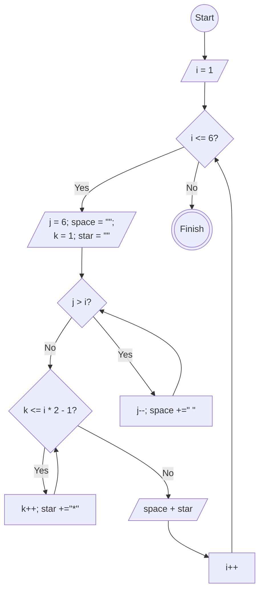

# Homework

## Edisi Pattern Segitiga

```mermaid
flowchart TD

A@{shape: circle, label: 'Start'}
B@{shape: lean-r, label: 'i = 1'}
C@{shape: diamond, label: 'i <= 6?'}
D@{shape: lean-r, label: 'j = 6; space = ""; <br>k = 1; star = ""'}
F@{shape: diamond, label: 'j > i?'}
G@{shape: diamond, label: 'k <= i * 2 - 1?'}
H@{shape: rectangle, label: 'j--; space +=" "'}
I@{shape: rectangle, label: 'k++; star +="*"'}
J@{shape: lean-r, label: 'space + star'}
Y@{shape: rectangle, label: 'i++'}
Z@{shape: dbl-circ, label: 'Finish'}

A-->B-->C
C-->|Yes| D
C-->|No| Z
D-->F
F-->|Yes| H
F-->|No | G
G-->|Yes| I
G-->|No| J
H-->F
I-->G
Y-->C
J-->Y
```
